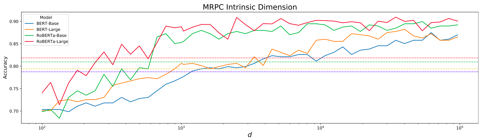
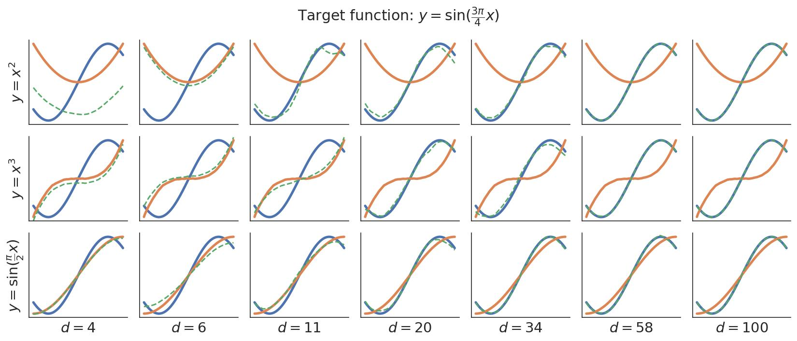

# Encoder warping

Code for a project investigating the use of neural encoding models who's representations can nonlinearly to align with those of the neural data being predicted, where the degree of this warping can be controlled by only modifying the model's parameters in a low-dimensional subspace.

### Contents
- [Encoder warping](#encoder-warping)
    - [Contents](#contents)
- [Project overview](#project-overview)
    - [Problem description](#problem-description)
    - [Task dimensionality](#task-dimensionality)
    - [Comparing encoding models based on $d$](#comparing-encoding-models-based-on-d)
- [Code structure](#code-structure)
    - [`low_dim/`](#low_dim)
    - [`models/`](#models)
    - [`datasets/`](#datasets)
    - [`tasks/`](#tasks)
    - [`scripts/`](#scripts)
    - [`simulations/`](#simulations)
    - [`tests/`](#tests)
- [Experiments](#experiments)
    - [TODO: $d$ for different encoding models](#todo-d-for-different-encoding-models)
    - [Preliminary results training one model at different $d$](#preliminary-results-training-one-model-at-different-d)
- [Future ideas](#future-ideas)
    - [Skip the linear encoding layer](#skip-the-linear-encoding-layer)
    - [Fit the linear layer first, then consider it as part of the model](#fit-the-linear-layer-first-then-consider-it-as-part-of-the-model)

# Project overview

### Problem description

Linear encoding models allow us to compare representations while allowing for invariance to linear transformations. While this seems sensible, we might want to permit a certain degree of nonlinear transformations in order to align the representations. Some brain region and a model might learn similar representational manifolds that are nevertheless non-linearly warped relative to each other. For instance, maybe the neural representation maps stimuli to a flat 2d sheet while the model maps them onto a curved 2d sheet; the manifolds are not so dissimilar, but no linear transformation can nicely align them.

At the other extreme, we don’t want to be invariant to arbitrarily complex nonlinear transformations, because then we would be able to align any representations that are highly dissimilar. For instance, we can easily map an image pixel representation to some brain region with a CNN, but it wouldn’t make much sense to say that the pixel representation and the brain are similar.

An interesting alternative might be to allow arbitrary nonlinear transformations, but instead quantifying similarity through predictive performance we can quantify it via the *complexity* of the transformation. If a model is able to achieve good predictive accuracy with only a simple nonlinear change to its representations, then it makes sense to say that it is a good model of the brain region it was fit to.

### Task dimensionality

This [paper](https://arxiv.org/abs/1804.08838) developed a method which can be used to modulate the complexity with which we warp a particular representation. Essentially, it allows us to train a model that has many parameters (e.g. a deep neural network), while only modifying these parameters through a low-dimensional parameter subspace. Effectively, there is a random projection from a low-dimensional parameter embedding vector of size $d$ to the model's full parameter space of size $D$, and importantly we only optimize the $d$-dimensional parameter embedding vector. What this results in is that the larger $d$ is, the more degrees of freedom we have to change the model's representations, and therefore the more complex the change in the representations can be.

A follow-up [paper](https://arxiv.org/abs/2012.13255) to the work used this method to compare different models in a transfer-learning setting. Essentially, for different language models fine-tuned on downstream transfer tasks, they compared the $d$ at which they achieved a certain threshold of performance. Their finding was that large language models, despite having more parameters, achieve the same level of transfer performance as smaller models at a much smaller $d$ (see image below). The takeaway for our purposes is that these large models had representations that could more easily be warped to the downstream task, where "ease" means that the warping function had lower complexity (lower $d$).

### Comparing encoding models based on $d$

If we want to compare two models, we can see how large $d$ must be for each of them to achieve the same encoding performance. Because we are still trying to predict some target neural activity, we’ll also need to add an extra linear layer at the end of the model as in ordinary encoding models, but the main emphasis for judging model quality will be on $d$. The rationale here is that even if two models achieve similar encoding performance when we allow all of their parameters to change, the model that can reach that encoding performance with a smaller $d$ required less warping of its representations. In other words, its representations were more similar to those of the brain, since we were able to align it to the brain using a low-complexity nonlinear transformation.

This concept is illustrated in the figure below. Say we have some target representation (the function in blue) and some candidate models (the 3 functions in orange on separate rows). All of these functions using an MLP neural network, so they have lots of parameters. We can fine-tune the candidate models to fit the target representation using increasingly large parameter embedding spaces $d$, shown on successive columns (dotted functions in green show these fits). As $d$ increases, eventually all models fit the representation. However, the model in the bottom row is able to achieve the same quality of fit using a smaller $d$, by virtue of it being more similar to the target representation to begin with.

# Code structure

### `low_dim/`

Contains the wrapper class for generating a copy of a `nn.Module` that has a low-dimensional parameter embedding. Any arbitrary `PyTorch` model can be passed in. You can specify (1) the dimensionality of the parameter embedding and (2) groups of layer names which will have their own learned scaling factors. See the [task dimensionality paper](https://arxiv.org/abs/2012.13255) for details regarding the Fastfood transform that projects low-dimensional parameters to a high-dimensional space and the layer scaling factors. Importantly, a `FastfoodWrapper` model's only trainable parameters will be the low-dimensional embedding and the scaling factors.

### `models/`

Definitions for PyTorch models (i.e. `nn.Module`'s) used in experiments. The models should implement the interface specified in `models.base.BaseModelLayer`, which requires you to specify additional data properties in the model which will be used elsewhere in the code (e.g. the layer you want activations for, the output sizes of each layer, etc.). See `models.torchvision_models.ResNet18Layer` for an example of a class that implements the `BaseModelLayer` interface.

When adding new models, make sure to edit the `models.__init__.get_model()` function so that your model can be retrieved from scripts that train arbitrary encoding models.

### `datasets/`

Definitions for PyTorch `DataPipe`'s and PyTorch Lightning `LightningDataModules`'s that are used in experiments. The datasets should implement the interface specified in `datasets.base.BaseDataModule`, which requires you to specify additional data properties in the dataset which will be used elsewhere in the code (e.g. the number of outputs targets, such as voxels). See `datasets.nsd.NSDDataModule` for an example of a class that implements the `BaseDataModule` interface.

When adding new datasets, make sure to edit the `'scripts.utils.get_datamodule()` function so that your dataset can be retrieved from scripts that train arbitrary encoding models.

### `tasks/`

Definitions for Pytorch Lightning `LightningModule`'s that are used to train models in experiments.

For standard encoding models where the targets are continuous vectors, the classes defined in `tasks.regression` should suffice. If for some reason you want to do some very different kind of training, feel free to either extend the functionality of those classes or add new ones to `tasks/` folder.

### `scripts/`

Files in here should contain the code that generates data for any subsequent experiments/figures. The preference is that these scripts should take in argument configurations using the [hydra](https://hydra.cc/) Python library (very simple to use, you can learn it in 10min). The configurations files used by hydra are in `scripts/configurations/`.

Scripts implemented so far:
- `encoding_dim.py`: Fit encoding models through gradient descent using an increasing number of low-dimensional parameter embeddings. The resulting test set performance for all values of $d$, as well as TensorBoard training curves, will be saved in `saved_runs/encoding_dim/[your run name]/results.csv`.
- `ols_linear_encoder.py`: Fit an encoding model through OLS or Ridge regression. This is mainly for quick sanity checks to see what kind of performance you should expect on a given neural dataset, since training with gradient descent can be slow and is sensitive to hyperparameters.

All scripts can be run from the command line as modules:
`python -m scripts.[script name] [hydra argument overrides]` 

### `simulations/`

Experiments on simulated data to develop theories and intuitions. Each kind of simulation should be in a standalone folder, and can have its own scripts, helper files, notebooks, etc.

Simulations implemented so far:
- `dim_complexity/`: Examples of simple functions being fit to a target function using an increasing number of low-dimensional parameter embeddings.

### `tests/`

Unit tests using the `pytest` library. *Please* try to add additional unit tests for new code that you write, and re-run existing tests if you change something in the classes/functions that are currently implemented.

# Experiments

### TODO: $d$ for different encoding models

The main goal of this study is to compare different models by the $d$ they require to reach a given level of encoding performance on a particular neural dataset. Call this value $d_{warp}$. Things to try include:
- Different neural datasets (including different ROIs, recording modalities, and species).
- Different model architectures.
- Different layers (e.g. depths).
- Different training tasks.
- Different pre-training datasets (e.g. not just ImageNet).

In particular, we want to see if we learn something new by comparing models according to $d_{warp}$ that isn't so obvious when we just look at linear encoding performance. For instance, maybe models that have similar linear encoding performance have very different values of $d_{warp}$'.

### Preliminary results training one model at different $d$

So far, I've trained a deep layer of an ImageNet-trained ResNet18 at various levels of $d$ on (a) the Natural Scenes Dataset and (b) the Majaj & Hong 2015 dataset used in BrainScore. Both used high-level object-recognition ROIs (IT, LOC). You can find the paths to these datasets in the default hydra configurations at `scripts/configurations/data/` (some of these paths will be in my local folder, so just ping me if you can't read from them and need me to copy them elsewhere).

The results for these experiments are relatively encouraging. What I was looking for was whether or not higher values of $d$ tended to lead to better encoding performance, which is a pre-requisite for being able to compare models according to their $d$. This project will only work if different models eventually achieve the same encoding performance when $d$ is large enough, but reach some given threshold at very different values of $d$. So, we need some variance as a function of $d$ within a model, and ideally encoding performance should be increasing monotonically with $d$. By in large, this behavior has been observed, but the results are quite noisy (especially for NSD).

# Future ideas

### Skip the linear encoding layer

Really, we want to see how complex a change we need to make to the model before its representations align with those of the brain. Currently, after changing the model's representations by tuning its internal parameters, we still have a linear encoding layer at the end to optimize an actual alignment. This complicates the validity of the method, because that linear layer itself has parameters (the number of which will also depend on how many units are in the model's final representation). 

On the one hand, this kind of linear projection might be necessary given issues in the neural data such as limited numbers of stimuli, recordings from a limited number of brain regions, lossy/noisy recording modalities, subjects performing a single fixed task, etc.

Nevertheless, if we want to see something like "how many parameters must change in the model to align it with the neural representations", perhaps we can skip the linear projection entirely and use a sort of RSA objective function to train the low-dimensional parameter embedding. Since RSA can be differentiable, we should be able to write a loss function for it that can be optimized using gradient descent. 

Gradient descent methods would still be necessary because there's no other good way to optimize the DNN (i.e. we can't write a closed form solution for the optimal low-dimensional parameters). In addition, if the stimulus set is sufficiently large such that we can't pass it as an entire batch to the model and obtain gradients, we'll need an batched form of this RSA objective (although this might be as simple as just doing RSA on the current batch).

Note that this batched RSA-like objective is similar to some loss functions used in contrastive learning, since it considers the distance between all pairs of samples in the batch, so it's probably a theoretically-sound thing to do.

### Fit the linear layer first, then consider it as part of the model

To eliminate the same concern as above, Raj came up with an alternative idea. First, we can just fine-tune the final linear layer using SGD, or even OLS/Ridge/PLS (since we won't have to backpropagate through the rest of the model). Afterwards, we can consider the initial model + the linear layer as "the model", and fine-tune all of its parameters through the low-dimensional embedding. The linear layer's parameters would be included in the $D$-dimensional parameter space that the $P$ matrix projects to.

One of the advantages of this is that it would allow us to fit these linear projections on top of a concatenated vector of model layers. This is something that would not be easy to do with the RSA approach above, because that approach requires us to manually specify a layer-ROI correspondence ourselves.